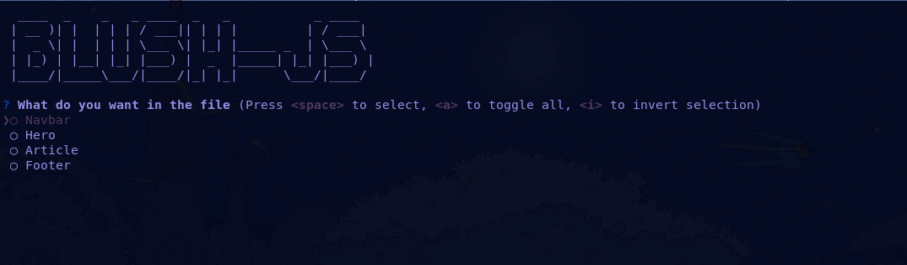

# Blush-js

A cli to generate boiler plate code for html and css. 

Well whenever I started the project it was a fuss to start everything from scratch   
Initially I wanted to make only css but well then I thoughts let's do html too.     

(Also a side note : If you find this totally useless then it's totally fine. I mean I am learning to this was  
made out of personal interest only.)

## Installation

    npm i -g blush-js

## Usage 
After installing run the following command in the folder you want to generate the code.
For first time this can take some time depending on your internet connection or either git is there or not.
        
    blush

After the above command you will see a this:

That's it select the things you want in your project and the code will be generated in the current directory..

### Upcoming stuff

- [ ] Responsive design
- [ ] A better cli
- [ ] Framework Specific generator

